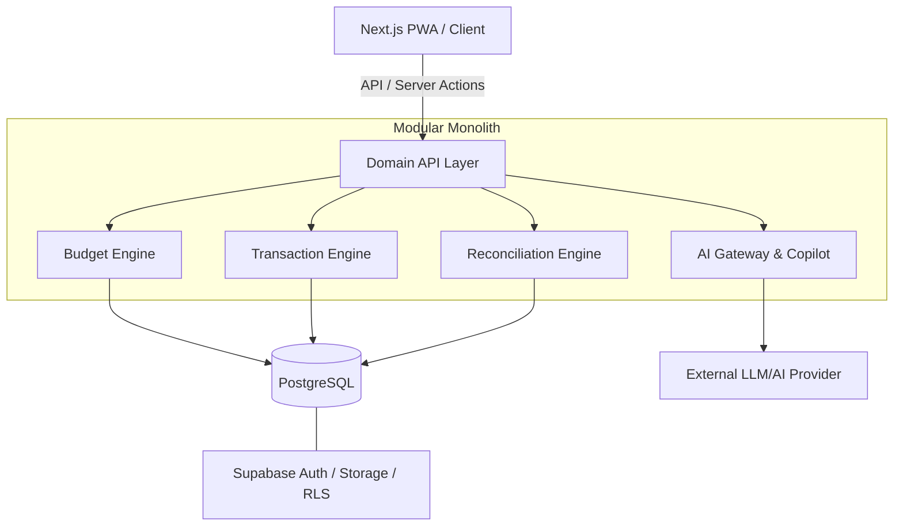

# Architecture — Bolsilludo

> Version: 1.0.0 | Iteration: I2 | Date: 2026-09-28

This document outlines the high-level architecture of Bolsilludo, following the principles of a modular monolith.

## 1. System Overview

Bolsilludo uses a Next.js (App Router) full-stack architecture backed by PostgreSQL (via Supabase) and Drizzle ORM. The business logic is isolated into pure domain engines that operate independently of the UI and database layers.

## 2. Core Modules

The application is split into specialized modules (located in `packages/`):
- **money**: Pure math, integer representation, and the `CalcInput` parser.
- **budget-engine**: Zero-based budgeting calculations, RTA, and rollovers.
- **transaction-engine**: Handling splits, transfers, refunds, and payees.
- **design-tokens**: The single source of truth for UI colors, spacing, and typography.
- **validation**: Zod schemas shared between client and server.

## 3. Database & Security

- **Source of Truth**: PostgreSQL is the strict source of truth. No caching layer (like Redis) is used for authoritative financial balances.
- **ORM**: Drizzle ORM ensures type-safe SQL execution.
- **Row-Level Security (RLS)**: Enforced at the database level via Supabase. All queries must assert `user_id` and `budget_id` permissions via `budget_members` joining.

## 4. Concurrency

- High-contention operations (like updating a `category_month` budget allocation) use **optimistic locking** (`version` integer) to prevent race conditions.
- Batch transaction imports or external webhooks use an `idempotency_key`.

## 5. Deployment

- **Hosting**: Vercel (or similar Edge-compatible platform) for the Next.js application.
- **Database**: Supabase managed PostgreSQL.
- **Background Jobs**: Trigger.dev or Supabase Edge Functions for recurring transactions and heavy analytical reporting.
